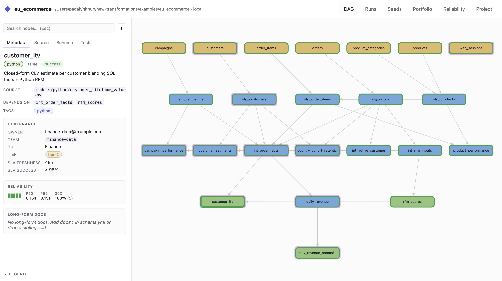
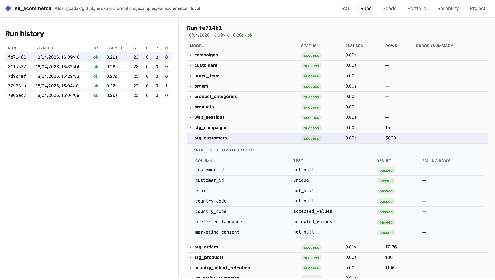

# Juncture

> Multi-backend SQL + Python transformation engine. Local-first,
> DuckDB-native.

**Status:** early beta (see [Releases](https://github.com/padak/juncture-engine/releases)
for the latest tag). Engine runs real workloads on
DuckDB end-to-end (pilot migration: 208 parquet seeds × 374 SQL
statements). Snowflake / BigQuery / JDBC adapters are Phase 2 —
stub only today.

One engine that replaces Keboola's four legacy transformation
components (`snowflake-transformation`, `python-transformation`,
`duckdb-transformation`, `dbt-transformation`). Code lives in git, SQL
and Python share one DAG, data tests are first-class, and every
workflow is callable from a stable JSON CLI built for agents.

*The name: a juncture is a meeting point. SQL meets Python in one
DAG; local DuckDB meets production warehouses via SQLGlot; four
legacy Keboola components collapse into one engine.*

<p align="center">
  
  <br><em>The DAG tab: shape encodes kind (seed / SQL / Python), border encodes last-run status, the pink ring propagates PII from flagged seeds. Sidebar shows Metadata + Source + Schema + Tests for the selected model.</em>
</p>

## Install

```bash
# End-user install -- CLI on your PATH, no repo checkout:
uv tool install --with pandas --with pyarrow git+https://github.com/padak/juncture-engine

# Contributor install -- editable checkout:
git clone git@github.com:padak/juncture-engine.git juncture
cd juncture
python -m venv .venv && source .venv/bin/activate
pip install -e ".[dev,pandas]"
```

`--with pandas --with pyarrow` keeps the `uv tool` env able to run
Python models (the `@transform` path imports pandas; `ctx.ref()`
returns an Arrow table via pyarrow). See
[`docs/TUTORIAL.md §Managing the Juncture environment`](docs/TUTORIAL.md#managing-the-juncture-environment)
for adding more packages later (`scikit-learn`, …) or upgrading Juncture itself.

## See it work first (60 seconds)

The fastest way to understand what Juncture does is to run an example
and open the browser UI. No scaffolding, no warehouse credentials.

```bash
# Build all models + run data tests against DuckDB.
juncture run --project examples/tutorial_shop --test

# Open the DAG + source viewer + run history.
juncture web --project examples/tutorial_shop
# -> http://127.0.0.1:8765
```

Then try a runtime parameter override — no SQL edits:

```bash
juncture run --project examples/tutorial_shop \
  --var as_of=2026-01-20 --var lookback_days=7
```

### Or: let Claude drive (Claude Code plugin)

This repo ships a **Claude Code plugin** that teaches any Claude session
every Juncture mechanic: project shape, all five materializations, the
migration repair loop (`continue-on-error → diagnostics → sanitize`),
profile-based dev/staging/prod, the full `juncture.yaml` + `schema.yml`
reference, and a troubleshooting recipe book. Progressive disclosure
under the hood — lean `SKILL.md` as a navigation hub plus five
references the agent loads only when the task touches them. No giant
prompt dump in your context window.

Install once, use from any directory:

```bash
# Add this repo as a plugin marketplace, then install the plugin:
claude plugin marketplace add padak/juncture-engine
claude plugin install juncture@juncture-engine
```

Then ask Claude things like:

- *"Scaffold a Juncture project for an e-commerce shop with daily revenue and cohort retention."*
- *"I have a Snowflake transformation in `kbagent sync pull` format. Migrate it to DuckDB and fix the EXECUTE errors."*
- *"Add a `prod` profile that targets Snowflake while keeping `dev` on local DuckDB."*

Plugin source under [`plugins/juncture/`](plugins/juncture/),
marketplace manifest in [`.claude-plugin/marketplace.json`](.claude-plugin/marketplace.json).
When you clone this repo, the same skill auto-loads via the
project-level `.claude/skills/juncture` symlink — no install needed
inside the repo itself.

## Build your own project

Open [`docs/TUTORIAL.md`](docs/TUTORIAL.md). Four levels, each adds one
idea on top of the previous:

| Level | What you learn |
|---|---|
| **L1** | `juncture init` → drop CSVs → first `ref()` → `juncture run` |
| **L2** | `@transform` Python models in the same DAG as SQL |
| **L3** | `macros/*.sql` (shared expressions) + ephemeral models (shared dimensions) |
| **L4** | External parameters via `--var` and `juncture.yaml vars:` |

The tutorial's companion project lives at
[`examples/tutorial_shop/`](examples/tutorial_shop/) so you can
copy-paste-compare while you read.

## What ships today

### Engine (runs on DuckDB)

- **SQL + Python in one DAG.** A Python `@transform` can `ref()` a SQL
  model and vice versa. One `juncture run` builds everything.
- **Materializations:** `table`, `view`, `incremental` (with
  `_juncture_state` checkpoint), `ephemeral`, `execute` (multi-statement
  as-is — used by migration tooling).
- **Parallelism by default.** Independent models run concurrently, layer
  by layer. Intra-script parallel EXECUTE available for migrated bodies
  (known race — forced to `parallelism: 1` for now).
- **Data tests are first-class.** `not_null`, `unique`, `relationships`,
  `accepted_values`, plus custom SQL tests under `tests/`.
- **Seeds.** Single CSV (`seeds/*.csv`) or parquet directories
  (`seeds/bucket/table/*.parquet`) with hybrid full-scan / sample type
  inference and a sentinel detector for Keboola-style string columns.
- **Jinja macros** (when `jinja: true`): every `` under
  `macros/` is globally available without `` — dbt-style UX.
- **Model disable toggle**: `disabled: true` in `schema.yml` or
  `--disable a,b` / `--enable-only x,y` at runtime.
- **Governance fields** in `schema.yml`: `owner`, `team`, `criticality`,
  `sla.freshness_hours`, `docs`, `consumers`. Seeds carry `pii`,
  `retention_days`, `source_system`.

### Browser UI (`juncture web`)

Stdlib HTTP server, no extras dependency, vendored cytoscape + prism +
markdown-it. Tabs:

- **DAG** — kind-distinguishable shapes (seed = parallelogram, SQL =
  blue, Python = green) + border-encoded last-run status + PII ring
  propagation from flagged seeds. Click a node for a Metadata / Source
  / Schema / Tests drilldown.
- **Runs** — history table + per-model drawer with every
  `statement_errors` entry classified into buckets (type_mismatch /
  conversion / missing_object / …).

<p align="center">
  
  <br><em>The Runs tab: click any model row to expand its drawer with statement-level errors and the data tests filtered to that model.</em>
</p>

- **Seeds** — format, inferred types, sentinel cache, parquet file
  count.
- **Portfolio** — model × owner × SLA × 30-day attainment with
  freshness/success breach pills.
- **Reliability** — per-tier SLA attainment + slowest-10 + top
  failure buckets.
- **Project** — parsed `juncture.yaml`, rendered README, git HEAD.
- Download buttons in the DAG toolbar: `manifest.json`,
  `manifest.openlineage.json`, and **`llm-knowledge.json`** — a
  single-shot project snapshot (config + full source + seeds + latest
  run) for paste-into-Claude workflows.

### Migration tooling

- **`juncture migrate keboola`** — raw Keboola config JSON → Juncture
  project.
- **`juncture migrate sync-pull`** — reads the `kbagent sync pull`
  filesystem layout (symlinked parquet pools, SQL scripts) and produces
  a Juncture project with `EXECUTE` materialization.
- **`juncture sql split-execute`** — rewrites a multi-statement EXECUTE
  monolith into one `.sql` per CTAS target with auto-inferred `ref()`
  dependencies.
- **`juncture sql translate`** — SQLGlot dialect translation
  (Snowflake → DuckDB, etc.) with schema-aware type annotation and AST
  passes (`harmonize_case_types`, `harmonize_binary_ops`,
  `fix_timestamp_arithmetic`).
- **`juncture debug diagnostics`** — regex-based classifier for DuckDB
  error messages; buckets + subcategories + fix hints for the next
  repair iteration.

### Agent surface

- **Claude Code plugin** at [`plugins/juncture/`](plugins/juncture/) —
  install via `claude plugin install juncture@juncture-engine` after
  adding `padak/juncture-engine` as a marketplace. Skill content lives
  at `plugins/juncture/skills/juncture/` (lean `SKILL.md` + 5
  `references/`); also symlinked into `.claude/skills/` for
  auto-loading inside this repo.
- **Stable JSON CLI**: `juncture compile --json`, `juncture run
  --json`, structured manifest with DAG + columns + tests.
- **MCP server** skeleton under `juncture.mcp.server` (not yet shipping
  — Phase 3).
- **`/api/llm-knowledge`** — one JSON with everything a model needs to
  reason about the project (see Browser UI above).

## Development plan

Rationale in [`docs/VISION.md`](docs/VISION.md), task list in
[`docs/ROADMAP.md`](docs/ROADMAP.md).

### Phase 2 — adapters and Keboola

- **Warehouse adapters:** Snowflake, BigQuery, JDBC. Stubs exist;
  real `materialize_sql`, `MERGE INTO` incrementals, and
  Arrow-backed `fetch_ref` are the Phase 2 scope. Unlocks the
  one-project-many-backends story below.
- **Keboola component:** Docker wrapper runs today against static
  Storage exports; real SAPI output upload + dev/prod branch mapping
  land here.
- **OpenLineage runtime emitter:** skeleton in
  `juncture.observability.lineage`; static export via
  `/api/manifest/openlineage` already works.

### Phase 4 — differentiators

- **Backend arbitrage via dialect translation.** The same project
  runs on DuckDB locally and on Snowflake / BigQuery / JDBC in
  production. SQLGlot handles the dialect diff; authors write one
  SQL and let the engine target whichever backend fits the workload.
  Ships with Phase 2 adapters.
- **Virtual data environments.** Hashes of model attributes create
  snapshot tables; promoting to prod is a pointer swap. Dev branches
  get a real isolated dataset with zero recompute until a model
  changes. Combined with Keboola dev branches: every Keboola branch
  becomes a real, free environment.
- **AI dialect arbitrage.** The engine auto-switches DuckDB ↔
  warehouse based on data size and cost. Small slice fits in RAM
  → run on DuckDB for free. Slice grows → spill to Snowflake /
  BigQuery transparently, same project, no user decision. A laptop
  stays a laptop until the data genuinely needs a warehouse.
- **Semantic / metrics layer.** Express "active customer",
  "monthly recurring revenue", "EU region" once; consume the same
  definition from SQL models, Python models, and BI tools. The
  metric and the transformation that produces it live in one file.
- **Agentic authoring.** A prompt like _"build me a daily orders
  dashboard"_ scaffolds, runs, tests, and iterates a project
  end-to-end. Builds on the already-shipping agent surface:
  `juncture compile --json`, `/api/llm-knowledge` (one-JSON
  project snapshot for LLM context), the Claude Agent Skill, and
  the MCP server (Phase 3). Goal: a working pipeline from a
  sentence, without opening a Jinja macro.

Each item ships after it's been tested on a real production workload.

## Example minimal Python model

```python
# models/revenue_summary.py
from juncture import transform


@transform(depends_on=["stg_orders"])
def revenue_summary(ctx):
    orders = ctx.ref("stg_orders").to_pandas()
    window = int(ctx.vars("lookback_days", 30))
    return (
        orders[orders["order_date"] >= orders["order_date"].max()
               - pd.Timedelta(days=window)]
        .groupby("country")["amount"]
        .sum()
        .reset_index()
    )
```

The function receives a `TransformContext`; `ctx.ref(name)` returns an
Arrow Table, `ctx.vars(key, default)` reads the same external params
as SQL's `{{ var('key') }}`.

## Doc map

- [`docs/VISION.md`](docs/VISION.md) — what + why. Stable reference.
- [`docs/TUTORIAL.md`](docs/TUTORIAL.md) — L1→L4 onboarding narrative.
- [`docs/CONFIGURATION.md`](docs/CONFIGURATION.md) — `juncture.yaml`,
  `.env`, `schema.yml`, seeds, macros, parallel EXECUTE.
- [`docs/DESIGN.md`](docs/DESIGN.md) — architecture (Project, DAG,
  Adapter, Executor, Testing, Seeds, Migration).
- [`docs/ROADMAP.md`](docs/ROADMAP.md) — phased task list.

## License

Apache 2.0. See [`LICENSE`](LICENSE).
